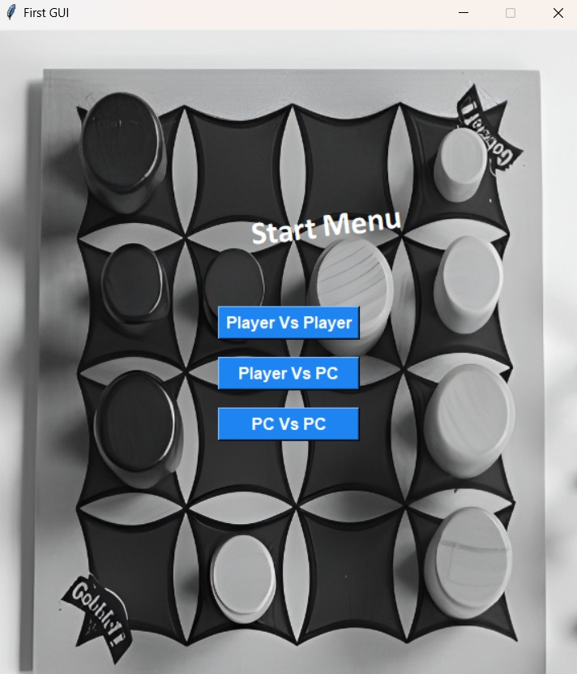
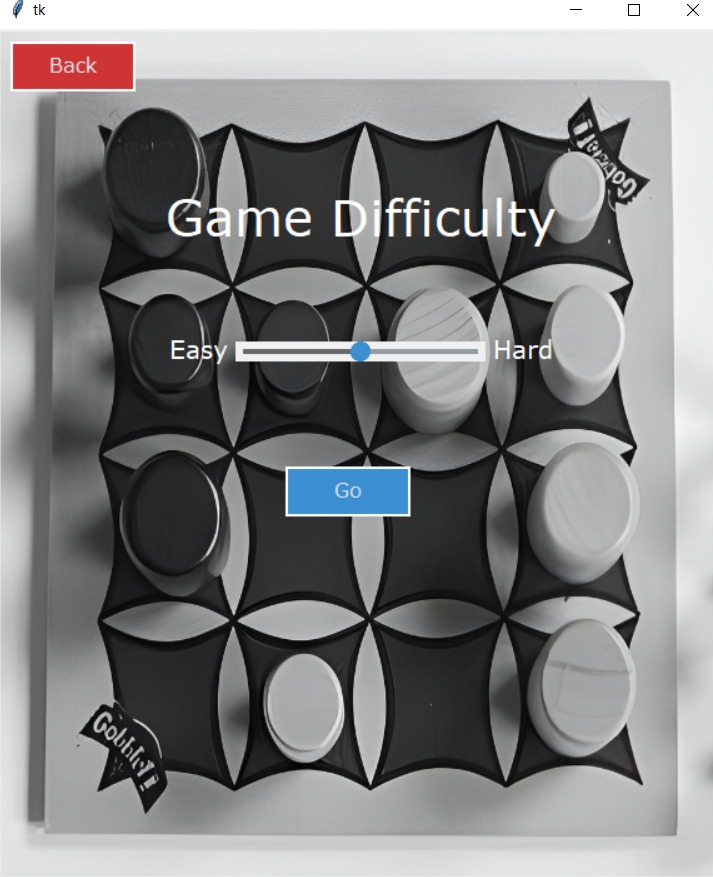
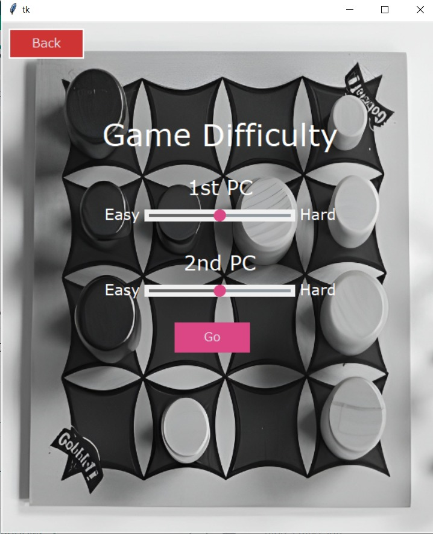
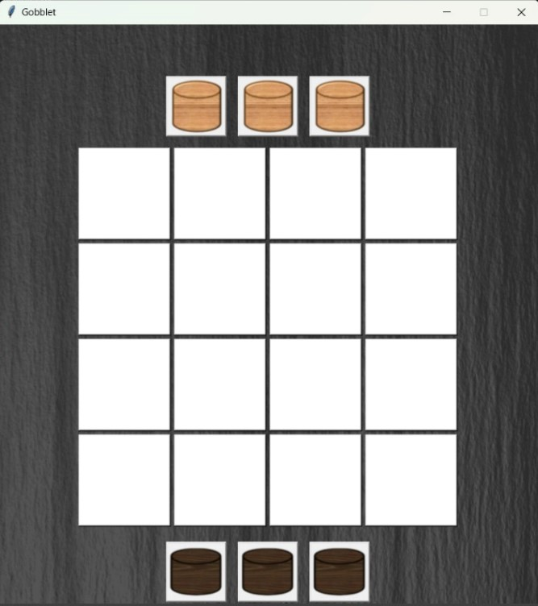

# Gobblet AI Player Game

## Table of Contents
- [Introduction](#introduction)
- [Game Rules](#game-rules)
- [Project Features](#project-features)
- [User Manual](#user-manual)
- [Contributions](#Contributions)

## Introduction
This is a project for the course of Artificial Intelligence at Ain Shams University.In this project, we implement the Gobblet game, an abstract strategy game played on a 4x4 grid. The game involves two players, each with twelve pieces that can nest on top of one another to create three stacks of four pieces.

### Game Rules

### Objective

The goal of Gobblet is to place four like-colored pieces in a horizontal, vertical, or diagonal row. Each player's pieces start nested off the board. On a turn, a player can either play one exposed piece from their three off-the-board piles or move one piece on the board to any other spot where it fits. Larger pieces can cover smaller ones, but a piece being played from off the board may not cover an opponent's piece unless it's in a row where the opponent already has three pieces of their color.

### Memory Challenge

Players need to remember which color one of their larger pieces is covering before moving it. If a player has four like-colored pieces in a row, they win the game. However, there is an exception: if a player lifts their piece and reveals an opponent's piece that completes a four-in-a-row, they don't immediately lose. They can't return the piece to its starting location, but if they can place it over one of the opponent's three other pieces in that row, the game continues.

### Components

- **16-square playing board**
- **12 white Gobblets**
- **12 black Gobblets**

**The RULES OF THE GAME are essential to understanding the gameplay. Make sure to go through them before starting.**

[Watch the instructional video here.](https://www.youtube.com/watch?v=aSaAjQY8_b0)

## Project Features
### Modes
The game supports 3 different modes of playing:
1.	Human vs. Human
2.	Human vs. Computer
3.	Computer vs. Computer

### Difficulty levels
Adjust the difficulty levels for the AI opponents to suit your gaming preferences:
1.	Easy
2.	Hard

### User Interface Features
The user interface supports multiple features:
1.	Visualize the current game board and pieces on it.
2.	Human players can make moves effortlessly by clicking on the board.
3.	Upon completion of the game, the winner is announced clearly.

# User Manual

The Gobblet Game is designed for ease of use, providing a seamless gaming experience controlled entirely with the mouse. Follow the steps below to navigate through the game:

1. **Game Modes Selection:**
    - Upon opening the game, you'll encounter the main screen. Here, you have three buttons to choose the game mode:
        - Player vs Player
        - Player vs PC
        - PC vs PC

2. **Player vs Player:**
    - If you select Player vs Player, no additional options are needed. Enjoy the game directly with another player.

3. **Player vs PC:**
    - When choosing Player vs PC, the following screen will appear:
        - You have the option to choose the difficulty level of the PC player.
        - The difficulty level reflects enhanced heuristics and deeper search depth.
    
4. **PC vs PC:**
    - Opting for PC vs PC presents you with the following screen:
        - Similar to Player vs PC, you can select the difficulty level for both PC players.
        - The difficulty level influences the quality of heuristics and the depth of the search algorithm.
    

5. **Game Screen:**
    - After selecting the game mode and difficulty, you will be directed to the main game screen:
        - The game screen includes the playing board and pieces, providing a clear visual representation of the ongoing game.
    
6. **End of Game:**
    - Upon completion of the game, the final screen will announce the winner of the game.

**Note:** The game is entirely controlled with mouse interactions, making it accessible and intuitive for players of all levels.

Enjoy playing the Gobblet Game!

# Contributions
- Mostafa Mahmoud Ali Ahmed (ID: 1900034)
- Mohamed Khaled Mohamed Soliman (ID: 1900356)
- Abdelrahman Ali Mohamed Ali (ID: 1900913)
- Mustafa Osama Mohamed Mhamed (ID: 1900565)
- Maram Ahmed Hussein Mostafa (ID: 1900050)
- Mai Esmail Gamal Mohammed (ID: 1900171)
- Esraa Amr Abdelmoneam (ID: 1900061)
- Habiba Ahmed Alaa Eldin Mohamed (ID: 1900839)
- Aliaa Nabil Mahmoud Mohamed (ID: 1900949)

